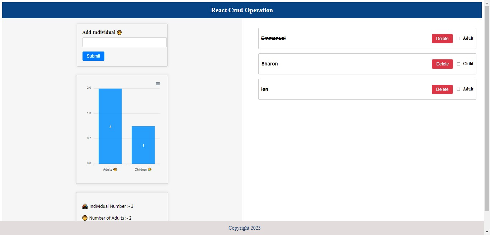

# React CRUD Application with ApexCharts
This is a CRUD (Create, Read, Update, Delete) application built using React and ApexCharts. The application allows users to manage data entries and visualize them using interactive charts.

# Features
Create, Read, Update, and Delete data entries.

Visualize data entries using interactive charts powered by ApexCharts.

Responsive design for a seamless experience on various devices.
Screenshots

# Screenshot

# Technologies Used
1.React.js: A JavaScript library for building user interfaces.

2.ApexCharts: A JavaScript charting library based on ApexCharts.js, used for creating interactive charts.

# Getting Started
Follow the steps below to get the project up and running on your local machine.

1.Installation

Clone the repository:
git clone https://github.com/Emmanuel687/React--CRUD.git
Navigate to the project directory:
bash

cd project-directory
Install the dependencies:

npm install

To start the development server and view the application in your browser, run:

npm start
or

This will start the development server and automatically open the application in your default web browser. You can now interact with the CRUD features and view the data visualizations on the charts.

# Contributing
Contributions are welcome! If you find any issues or want to enhance the application, please open an issue or submit a pull request.

# License
This project is licensed under the MIT License.

Thank you for using our React CRUD application with ApexCharts! If you have any questions or feedback, feel free to reach out.

Happy coding! 🚀

